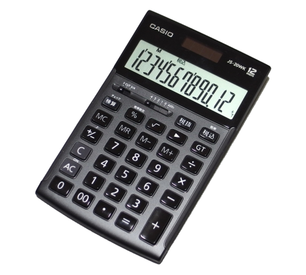

# Calculadora Python
Repositório do exercício do curso de Introdução à Programação, feito em Python, para expandir o programa e praticar GitHub.

# Utilização
1- Digite um número  
2- Digite um operador (+ - * / ^)  
3- Digite um segundo número  

O programa ira fazer a opereção desejada com os dois números que foram digitados.